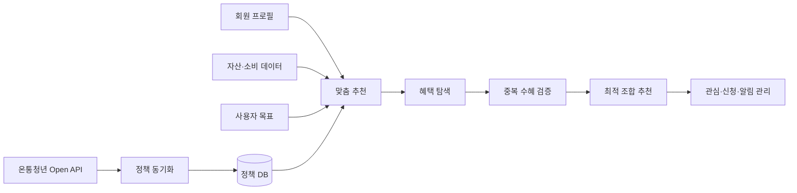
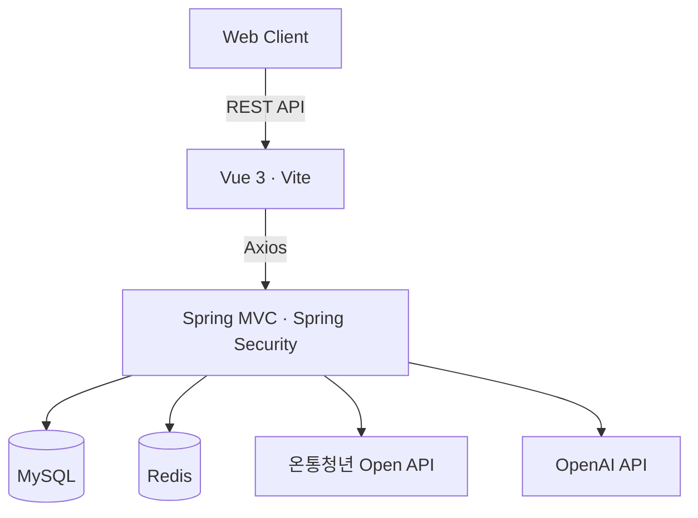

# 청년타파 (Youthtapa)


> 흩어진 청년정책을 한곳에서 찾고, 개인의 조건·소비·목표에 맞는 혜택과 최적의 조합까지 추천하는 청년 자산관리 서비스

청년타파는 정부·지자체의 청년 정책을 단순히 나열하는 데서 그치지 않고, 사용자의 프로필과 금융 생활을 바탕으로 **지금 신청할 수 있는 혜택을 발견하고 활용하도록 돕는 서비스**입니다. 온통청년 Open API 정책 데이터와 사용자의 자산·소비·목표 정보를 연결해 탐색, 추천, 조합 최적화, 사후 관리까지 하나의 흐름으로 제공합니다.

## 기획 배경

기존 청년 정책 서비스는 정보가 여러 기관에 흩어져 있고 검색 조건이 복잡해, 사용자가 자신에게 필요한 혜택을 놓치기 쉽습니다. 청년타파는 다음 문제를 해결하는 데 초점을 맞췄습니다.

- 개인 조건과 무관한 정책이 함께 노출되는 문제
- 신청 마감이 임박한 정책을 빠르게 찾기 어려운 문제
- 동시에 받을 수 없는 혜택을 사용자가 직접 비교해야 하는 문제
- 정책 정보와 실제 자산·소비 관리가 분리되어 있는 문제
- 대량의 정책 데이터를 최신 상태로 유지하고 변경 이력을 확인하기 어려운 문제

## 핵심 기능

### 1. 맞춤형 청년혜택 탐색

온통청년 Open API로 수집한 정책 데이터를 사용자의 조건과 관심사에 맞게 걸러 보여주는 기능입니다. 단순 나열이 아니라 프로필 조건, 소비 패턴, 설정한 목표라는 서로 다른 기준으로 추천 결과를 제공합니다.

- 카테고리·지역·키워드 기반 정책 검색
- 나이, 거주지, 소득, 취업 상태 등 프로필 조건 기반 추천
- 소비 카테고리와 사용자가 설정한 목표 기반 추천
- 추천 검색어와 최근 검색어 제공
- 정책 상세 정보, 공식 신청 링크, 관심·신청 혜택 관리

### 2. 혜택 조합 최적화

여러 정책을 동시에 신청할 때 발생할 수 있는 중복수혜 문제를 자동으로 걸러내고, 실제로 함께 신청 가능한 정책을 조합해 제시하는 기능입니다.

- 신청 가능한 정책 중 지원 효과가 높은 조합 추천
- 중복 수혜가 불가능한 정책 자동 제외
- 일부 제한 또는 추가 확인이 필요한 정책 경고
- 이미 신청한 혜택을 반영한 추천 결과 제공

### 3. 자산 및 금융 스트레스 테스트

자산 관리에 익숙하지 않은 MZ세대를 위해 과거 경제 위기 시나리오를 적용하여 위기 상황에서의 재정 대응력을 미리 점검해볼 수 있게 하는 기능입니다.

- 총자산, 계좌별 잔액, 자산 비율 조회
- 보유 금융상품 연결 및 확인
- 외환위기 등 기본 시나리오와 사용자 정의 시나리오 제공
- 자산별 충격값을 적용한 예상 손실 및 잔존 자산 계산

### 4. 소비 관리와 AI 분석

실제 소비 내역과 예상 소비를 함께 관리하고, AI의 소비 패턴 분석 결과를 제공하는 기능입니다.

- 월별 소비 캘린더와 카테고리별 지출 조회
- 예상 소비 등록·수정·삭제 및 정기 예상 소비 관리
- 월별 소비 추이와 소비 패턴 시각화
- AI 기반 소비 분석 및 맞춤형 개선 의견 제공

### 5. 마이페이지와 알림

회원 인증과 개인 정보, 그리고 혜택·계정 관련 알림을 관리하는 기능입니다.

- 회원가입, 로그인, 아이디 찾기, 비밀번호 재설정
- 개인 프로필과 목표 설정·수정
- 관심 혜택과 신청 혜택 조회
- 신청 마감 및 계정 활동 알림 관리
- Access Token·Refresh Token 기반 인증과 Redis 토큰 관리

### 6. 정책 데이터 운영 및 관리자 기능

대량의 정책 데이터를 최신 상태로 유지하고, AI 분석 프롬프트를 관리자가 검수·운영할 수 있도록 지원하는 기능입니다.

- 온통청년 Open API 자동 스케줄 동기화 및 기간 지정 수동 동기화
- 신규·변경·삭제 정책과 필드별 변경 이력 확인
- API 응답 실패 시 재시도하고, 최종 실패 시 정상 수집 범위까지 부분 반영
- 정책 활성 상태와 별도 신청 URL 관리
- AI 기반 중복 수혜 후보 분석, 검수, 적용 및 보류
- AI 프롬프트 버전 관리·테스트와 추천 검색어 관리
- 정책·회원·마감 임박 현황 및 최근 동기화 로그 대시보드 제공

## 서비스 흐름



## 시스템 구성



## 기술 스택

| 구분 | 기술 |
| --- | --- |
| Frontend | Vue 3, Vue Router, Pinia, Axios, Vite, Bootstrap, Chart.js |
| Backend | Java 17, Spring Framework 5.3, Spring MVC, Spring Security, MyBatis |
| Database | MySQL 8, Redis, HikariCP |
| Auth | JWT Access/Refresh Token, Spring Security |
| Data & AI | 온통청년 Open API, OpenAI API |
| Build & Deploy | Gradle 8, WAR, Apache Tomcat 9 |
| Collaboration | GitHub, Notion, Figma, Slack |

## 저장소 구성

이 프로젝트는 프론트엔드와 백엔드를 별도 저장소로 관리합니다.

```text
kb-final-frontend/
├─ src/api/             # REST API 모듈
├─ src/components/      # 공통·도메인 UI 컴포넌트
├─ src/pages/           # 사용자 및 관리자 화면
├─ src/router/          # 기능별 라우팅
└─ src/stores/          # Pinia 상태 관리

kb-final-backend/
├─ src/main/java/org/scoula/
│  ├─ admin/            # 관리자, 동기화 로그, AI 중복 검수
│  ├─ asset/            # 자산 및 금융상품
│  ├─ benefit/          # 정책 조회·추천·Open API 동기화
│  ├─ consumption/      # 소비·예상 소비·AI 분석
│  ├─ engine/           # 혜택 조합 최적화
│  ├─ member, mypage/   # 회원·프로필·목표
│  ├─ notification/     # 알림
│  ├─ security/         # JWT 인증·인가
│  └─ stress/           # 금융 스트레스 테스트
├─ src/main/resources/db/       # 스키마와 초기 데이터
└─ src/main/webapp/resources/   # 프론트엔드 빌드 결과
```

## 시작하기

### 요구 사항

- JDK 17
- Node.js 20.19 이상 또는 22.12 이상
- MySQL 8
- Redis
- Apache Tomcat 9
- 온통청년 Open API 키
- OpenAI API 키

> 백엔드는 `javax.servlet` 기반이므로 Jakarta 패키지를 사용하는 Tomcat 10 이상이 아닌 **Tomcat 9** 환경을 권장합니다.

### 1. 저장소 준비

프론트엔드와 백엔드 저장소를 같은 상위 디렉터리에 배치합니다.

```text
project-root/
├─ kb-final-backend/
└─ kb-final-frontend/
```

### 2. 데이터베이스 초기화

MySQL에 데이터베이스를 만든 뒤 `kb-final-backend/src/main/resources/db`의 SQL 파일을 아래 순서로 실행합니다.

```text
schema.sql
data_0_code.sql
data_1_base.sql
data_2_ai_prompt.sql
```

`engine_test_data.sql`, `sync_error_test.sql`은 기능 검증이 필요할 때 선택적으로 사용합니다.

### 2-1. Redis 실행

로컬에 설치된 Redis 서버를 실행합니다.

```bash
redis-server
```

정상 실행 여부는 아래 명령으로 확인할 수 있습니다.

```bash
redis-cli ping
```

`PONG` 응답이 오면 정상입니다.

> Docker를 사용한다면 `docker run -d -p 6379:6379 redis`로 대체할 수 있습니다.

### 3. 백엔드 설정

`kb-final-backend/src/main/resources/application.properties`를 생성하거나 환경에 맞게 설정합니다. 실제 비밀번호와 API 키는 Git에 커밋하지 않습니다.

```properties
jdbc.driver=net.sf.log4jdbc.sql.jdbcapi.DriverSpy
jdbc.url=jdbc:log4jdbc:mysql://localhost:3306/youthtapa
jdbc.username=${DB_USERNAME}
jdbc.password=${DB_PASSWORD}

redis.host=localhost
redis.port=6379

jwt.secret=${JWT_SECRET}

youthcenter.api.url=https://www.youthcenter.go.kr/go/ythip/getPlcy
youthcenter.api.key=${YOUTH_CENTER_API_KEY}

openai.api-key=${openai.api-key}
openai.model=gpt-4o-mini
```

### 4. 프론트엔드 실행

```bash
cd kb-final-frontend
npm install
npm run dev
```

개발 서버의 `/api` 요청은 기본적으로 `http://localhost:8080`의 백엔드로 프록시됩니다.

### 5. 백엔드 빌드 및 실행

프론트엔드를 먼저 빌드하면 결과물이 백엔드의 `src/main/webapp/resources`에 생성됩니다.

```bash
cd kb-final-frontend
npm run build

cd ../kb-final-backend
./gradlew clean war
```

Windows에서는 마지막 명령을 `gradlew.bat clean war`로 실행합니다. 생성된 `build/libs/kb-final-backend-1.0-SNAPSHOT.war`를 Tomcat 9에 배포합니다.

### 6. 관리자 기간별 동기화 실행

실행 날짜는 2023-11-01부터 현재 날짜까지로 설정

## 정책 동기화 처리 원칙

- 자동 동기화는 활성 정책의 API 제공 필드를 최신 값으로 갱신합니다.
- 신청 종료일이 지난 정책은 비활성 상태로 전환하되, 이미 비활성인 정책을 불필요하게 갱신하지 않습니다.
- API에서 더 이상 조회되지 않는 정책은 정상적으로 전체 호출을 완료했을 때만 삭제 정책으로 판정합니다.
- 첫 번째 호출 실패 시 DB 반영 없이 재시도합니다.
- 두 번째 호출도 중간에 실패하면 성공적으로 수집한 범위까지만 반영하고 로그를 `PARTIAL`로 기록합니다.
- 동기화 상세 로그에는 실제 필드 변경이 있는 정책만 표시해 운영자가 변경점을 빠르게 확인할 수 있습니다.

## 팀원 및 담당 기능

| 이름 | 담당 기능 |
| --- | --- |
| 정재훈 | 회원·인증, 마이페이지, 알림, 목표 기반 추천, DB 설계 |
| 박상호 | 관리자, 혜택 조합 최적화 엔진, 금융 스트레스 테스트 |
| 서예원 | 자산 조회, 소비 관리, AI 소비 분석, 소비 기반 추천 |
| 석예림 | 청년혜택 DB·조회·추천, 온통청년 Open API 연동 |

## 참고 사항

- 자산·소비 데이터는 프로젝트 DB의 시연 데이터를 사용하며 실제 금융기관 또는 마이데이터와 연결되지 않습니다.
- 정책 정보와 신청 가능 여부는 제공 기관 및 온통청년 Open API 데이터에 따라 달라질 수 있으므로, 최종 신청 전 공식 링크의 내용을 확인해야 합니다.
- API 키, JWT Secret, DB 계정 등 민감 정보는 별도의 로컬 설정 또는 배포 환경의 보안 설정으로 관리해 주세요.
